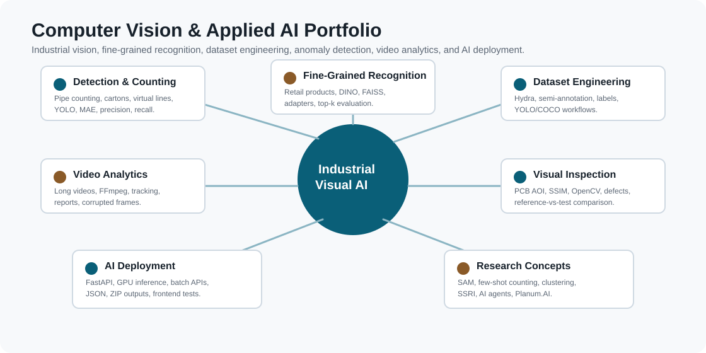

# Kalboussi Ala - Computer Vision & Applied AI Portfolio

I build applied AI systems around computer vision, dataset engineering, industrial automation, visual recognition, and deployable inference workflows.

This portfolio is a technical overview of my work. Some projects were built in company contexts, so I do not publish private datasets, model weights, production code, client images, or business-sensitive details. Instead, I present the engineering problems, system design, methods, evaluation logic, and lessons learned.

## Quick Links

- Portfolio website: https://kalboussiala.github.io/computer-vision-portfolio/
- Project index: [PROJECT_INDEX.md](PROJECT_INDEX.md)
- Research direction: [RESEARCH_DIRECTION.md](RESEARCH_DIRECTION.md)
- Case studies: [case-studies/](case-studies/)
- Contact: [LinkedIn](https://www.linkedin.com/in/ala-kalboussi-490163320/) | [GitHub](https://github.com/KalboussiAla) | kalboussi9@gmail.com

## Portfolio Map

## Main Technical Areas

| Area | What I worked on | Representative projects |
|---|---|---|
| Industrial detection and counting | YOLO detection, counting metrics, difficult-case analysis, video counting | Pipe counting, line-crossing videos, carton closing detection |
| Fine-grained recognition | Product/SKU classification, retrieval, embeddings, domain shift | Retail product recognition with YOLO + DINO + FAISS |
| Dataset engineering | Annotation, auto-annotation, label correction, dataset iteration | Hydra annotation platform, YOLO auto-labeling |
| Visual inspection | Reference-vs-test comparison, anomaly masks, defect counting | PCB AOI, black/brown spot counting, defect detection |
| AI systems and deployment | FastAPI, batch inference, GPU deployment, reports | Retail prediction backend, batch ZIP outputs |
| Advanced vision research ideas | Foundation models, SAM, DINO, few-shot counting, clustering | Generic segmentation, product clustering, reference gallery enrichment |

## Featured Case Studies

1. [Industrial Pipe Counting with YOLO](case-studies/industrial-pipe-counting.md)  
   Computer vision system for industrial tube detection and counting, with data-centric improvement and counting-oriented evaluation.

2. [Fine-Grained Retail Product Recognition](case-studies/fine-grained-retail-recognition.md)  
   Recognition workflow for approximately 500 visually similar product/SKU categories using YOLO, DINOv2/DINOv3, FAISS, kNN, adapters, and deployment APIs.

3. [Hydra Annotation Platform](case-studies/annotation-platform-hydra.md)  
   Internal annotation and semi-annotation platform for faster dataset creation and model iteration.

4. [Video Analytics and Line-Crossing Counting](case-studies/video-analytics-line-crossing.md)  
   Robust video processing scripts for object passage counting, batch reporting, corrupted frames, and FFmpeg output handling.

5. [PCB Anomaly Detection / AOI](case-studies/industrial-anomaly-detection-pcb.md)  
   Reference-vs-test inspection using OpenCV, SSIM, alignment, difference masks, and anomaly crop extraction.

## Extended Project Families

The full project map is in [PROJECT_INDEX.md](PROJECT_INDEX.md). It includes:

- industrial pipe counting;
- Hydra annotation platform;
- video counting with virtual lines;
- long-video processing and FFmpeg robustness;
- open/closed carton detection;
- face detection and blurring;
- retail product recognition;
- DINOv2/DINOv3 adapter experiments;
- FastAPI retail prediction backend;
- automatic product clustering;
- reference gallery enrichment;
- PCB/AOI anomaly detection;
- manual PCB region comparison;
- black/brown spot counting;
- YOLO defect detection;
- YOLO auto-annotation;
- generic segmentation and few-shot counting research ideas;
- cable/line connection analysis;
- SSRI, an intelligent road surveillance concept.

## Technical Stack

**Computer Vision / AI:** YOLO, DINOv2, DINOv3, ResNet, FAISS, kNN, OpenCV, SSIM, OCR, segmentation concepts, few-shot counting concepts  
**ML / Data:** PyTorch, TensorFlow, scikit-learn, NumPy, Pandas, Matplotlib, Seaborn, Optuna, experiment logs  
**Backend / Deployment:** FastAPI, Uvicorn, REST APIs, AWS/EC2 GPU deployment, Cloudflare Tunnel, batch inference, JSON and ZIP outputs  
**Software / Platform:** Python, Go, gRPC, Redis, S3-compatible storage, React, TypeScript, JavaScript, HTML/CSS  
**Dataset Engineering:** YOLO/COCO formats, semi-annotation, auto-annotation, label correction, dataset versioning, difficult-sample selection  

## What This Portfolio Is

This repository is not a dump of private company code. It is a structured technical portfolio:

- it explains what problems I solved;
- it shows the model families and pipelines I worked with;
- it highlights the engineering decisions behind the systems;
- it separates public information from confidential implementation details;
- it gives supervisors and recruiters a clear starting point for technical discussion.

For deeper technical interviews, I can discuss anonymized architectures, evaluation protocols, failure cases, and non-sensitive results.

