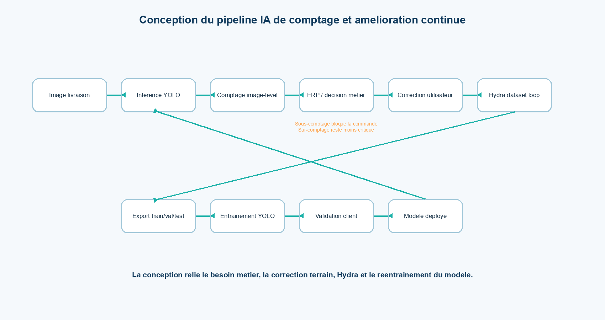
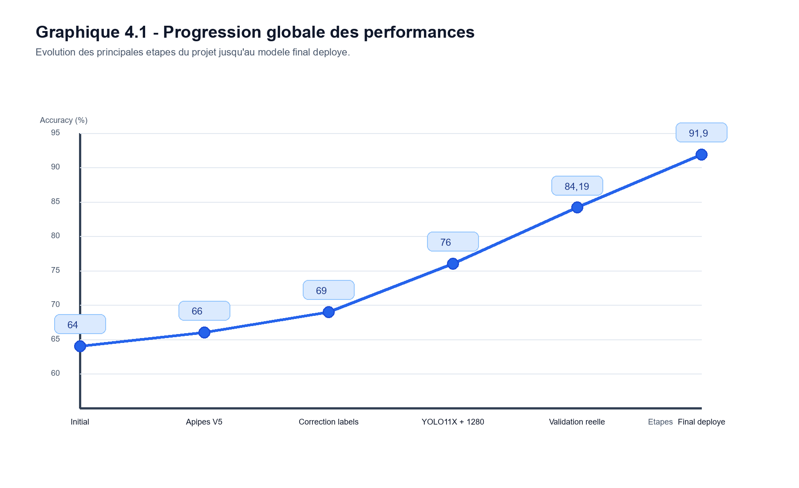
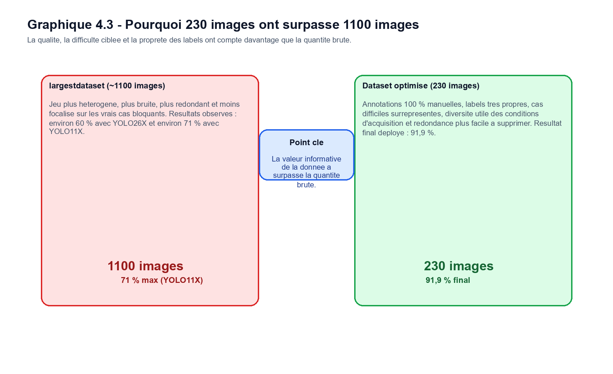
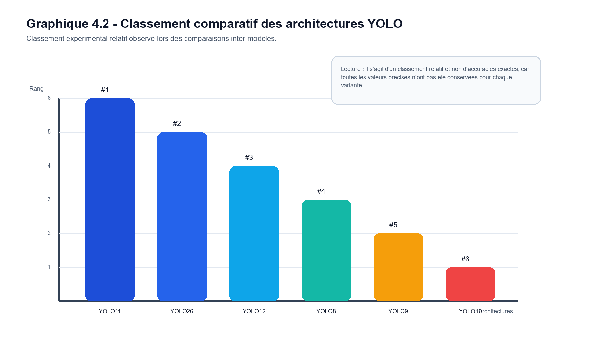
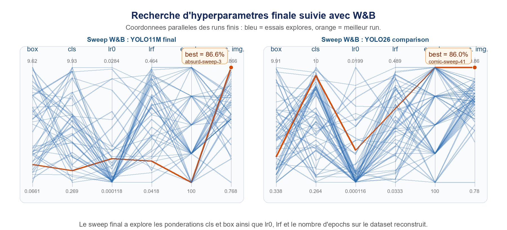

# Case Study - Industrial Pipe Counting with YOLO

## Context

This PFE project focused on automatic counting of industrial tubes/pipes from real delivery images. The business objective was practical: reduce manual counting, improve reliability, and support operational decisions where a wrong count can block or disturb the client workflow.

The project combined computer vision research, dataset engineering, model benchmarking, experiment tracking, backend testing, and deployment-oriented validation.

## My Role

- Reproduced the initial YOLO baseline and validated its real performance.
- Built and improved dataset versions, including Appipes V5 and corrected variants.
- Analyzed label quality, difficult images, simple vs complex scenes, and model failure modes.
- Benchmarked several YOLO families and deployment candidates.
- Tested advanced strategies: hybrid models, segmentation, multi-class group counting, controlled overfitting, and classifier-based orchestration.
- Built an online/backend testing environment for model evaluation.
- Validated the final model on real client delivery images and deployed the final model in the client workflow.

## Starting Point and Final Result

| Stage | Result / observation |
|---|---|
| Initial reproduced baseline | Around 64% image-level counting accuracy |
| Appipes V5 dataset iteration | Around 66% |
| Label correction and dataset cleanup | Around 69% |
| Image size and model-size experiments | Progression toward 72-76% |
| Real validation before final phase | Around 84.19% |
| Hybrid model strategy | Around 85.88%, but with stability trade-offs |
| Orchestrated architecture | Around 90.2%, but too complex for robust deployment |
| Final data-centric YOLO11M model | 91.8% image-level accuracy |

Final reported evaluation on real March/April delivery images:

- **Accuracy:** 91.8%
- **Precision:** 98.9%
- **Recall:** 98.1%
- **MAE:** 0.6 tube per image

## Visual Summary

## Approaches Tested

### 1. Baseline Reproduction

The first step was to reproduce the existing YOLO-based baseline. This was important because the project needed a trusted starting point before any improvement could be claimed. The reproduced baseline was around 64% image-level accuracy in the original evaluation context.

### 2. Dataset Correction and Versioning

The project quickly showed that performance was limited by data quality, not only by architecture. I worked on:

- creating and improving dataset versions such as Appipes V5;
- correcting noisy or inconsistent labels;
- separating simple and difficult samples;
- validating on independent real delivery images;
- comparing larger datasets against smaller, cleaner datasets.

The final direction was data-centric: a curated dataset of 230 high-quality manually annotated training images outperformed a larger heterogeneous dataset of around 1100 images.

### 3. YOLO Family Benchmarking

I compared several YOLO versions and variants:

- YOLOv8;
- YOLOv9;
- YOLOv10;
- YOLOv11;
- YOLOv12;
- YOLO26.

YOLO11 was the best overall choice for accuracy, stability, and deployability. YOLO26 was interesting on very difficult intertwined scenes, but it was less stable as a general production choice.

### 4. Difficult-Case Experiments

I tested controlled overfitting on difficult images for more than 2000 epochs in some experiments. This helped reveal which architectures could memorize or handle extreme cases. YOLO26 performed better on some highly complex scenes, while YOLO11 remained more reliable globally.

### 5. Multi-Class Group Counting

One experimental idea was to annotate groups of tubes as separate classes, such as groups of two, three, or four tubes. This was technically interesting, but limited by class imbalance and the low number of representative complex groups.

### 6. Segmentation

I tested YOLO segmentation with small manually annotated segmentation datasets. The masks were not stable enough for the industrial counting objective, and the annotation cost was high compared with the accuracy gain.

### 7. Hybrid Models

I tested hybrid strategies combining models such as YOLO11 and YOLO26. One direction used a max-count strategy to reduce under-counting, because under-counting was more problematic in the client process. This reached around 85.88%, but remained fragile because false positives from one model could damage the final count.

### 8. Classifier-Based Orchestration

Another strategy used a classifier to route each image to the model expected to perform best. This reached around 90.2%, but I rejected it as a final deployment solution because it added complexity, heavier inference, and risk when the classifier routed a difficult image incorrectly.

### 9. Final Data-Centric YOLO11M

The final model used YOLO11M with a smaller, cleaner dataset. This was selected because it balanced accuracy, stability, GPU memory, batch size, and deployment practicality.

## Experiment Scale

The project included:

- 1310+ YOLO training runs tracked during experimentation;
- 10,000+ prediction and intermediate validation runs;
- hyperparameter work on values such as `box`, `cls`, `lr0`, `lrf`, and epochs;
- repeated validation on real delivery images rather than only internal validation subsets.

## Deployment-Oriented Engineering

The final phase was not limited to notebook metrics. I also worked on an online/backend testing environment so models could be evaluated more realistically, and the final model was deployed in the client workflow after validation.

The selected model had to be practical, not only accurate:

- stable on real images;
- fast enough for operational use;
- simple enough to maintain;
- compatible with the client workflow;
- less sensitive to routing or orchestration errors.

## Key Lessons

1. In industrial counting, dataset quality can dominate architecture choice.
2. Counting metrics such as MAE are essential; detection metrics alone are not enough.
3. The best research result is not always the best deployment result.
4. A smaller, cleaner, well-curated dataset can beat a larger noisy dataset.
5. Tooling such as Hydra is part of the AI system because it controls dataset iteration speed and label quality.

## Research Directions

- Active learning for selecting the next most valuable images to annotate.
- Counting-aware losses and post-processing for dense repeated objects.
- Robustness to occlusion, lighting changes, and new camera setups.
- Foundation-model features for difficult-case retrieval and dataset curation.
- Few-shot counting methods for objects that are costly to annotate.
